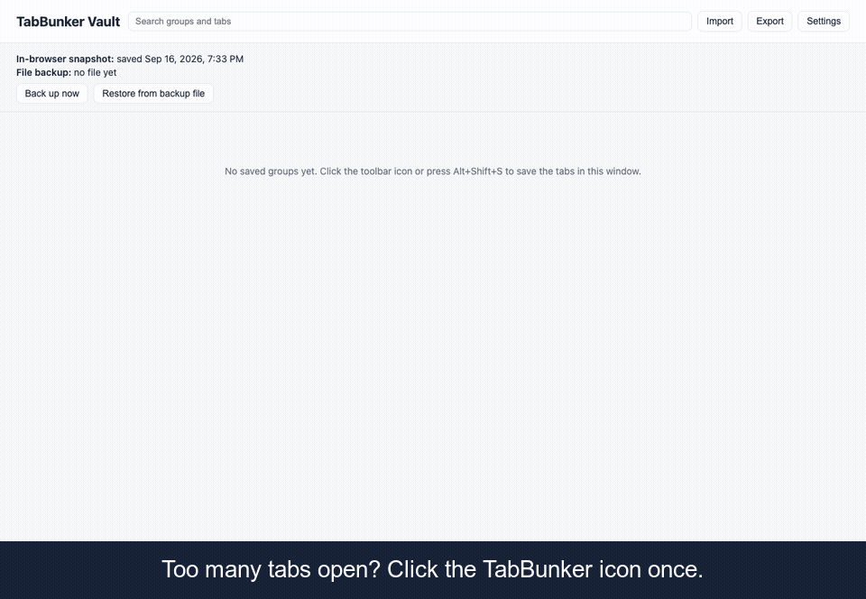

# TabBunker

**Close your tabs. Keep a backup.**

TabBunker is a Chrome, Edge, and Firefox extension that saves the tabs you pick to a vault on your own device. No account, no server. With file backup on by default, each change writes `Downloads/TabBunker/tabbunker-latest.json`, which stays after uninstall. Restore and import show a preview first. MIT licensed. No device sync. File backup can be turned off.

[Website](https://elitekid.github.io/tabbunker/) · [Recovery tool](https://elitekid.github.io/tabbunker/recover/) · [Privacy policy](PRIVACY.md) · [Report a problem](https://github.com/elitekid/tabbunker/issues)

[Chrome Web Store](https://chromewebstore.google.com/detail/tabbunker/gcfnjekbodlabpmiejgandamcpcgapgm), [Microsoft Edge Add-ons](https://microsoftedge.microsoft.com/addons/detail/tabbunker/ndidanjpalpcbjedoolkigdcnnfdhejf), and [Firefox Add-ons](https://addons.mozilla.org/en-US/firefox/addon/tabbunker/) offer version 1.1.0.



## Why two backups

TabBunker keeps two kinds of backup when you save tab groups:

1. **In-browser snapshot ring** — the last 20 snapshots live inside the extension (`chrome.storage.local` and IndexedDB).
2. **On-disk JSON files** — when file backup is enabled, `Downloads/TabBunker/tabbunker-latest.json` is overwritten after each change (30 seconds after the first unsaved change by default; 5 or 30 minutes selectable), plus a dated copy at most once an hour, keeping the 30 most recent.

Browser storage is convenient, but it is **not** a durable backup. Uninstalling the extension or resetting your browser profile removes everything stored inside the browser. The JSON files in your Downloads folder remain on disk and can be imported after a reinstall.

File backup is optional. If you turn it off, no files are created. TabBunker cannot protect against a failing disk or a deleted Downloads folder — keep copies elsewhere if that matters to you.

## Features

- **Choose and save tabs** — the toolbar icon opens a panel where you pick tabs, then save and close the selection or save it without closing. `Alt+Shift+S` keeps the quick action: it saves and closes the current window's tabs immediately.
- **Vault** — search, rename, lock, and drag tabs between groups; restore a single tab or a whole group.
- **Restore preview** — the vault lists every link before you restore, and asks first when a group has 30 or more tabs.
- **Automatic dual backup** — in-browser snapshot ring (20) plus optional JSON files in Downloads.
- **Trash** — deleted groups are kept for 30 days before permanent removal.
- **Undo** — one-step revert to the previous state.
- **Import** — OneTab text, Session Buddy JSON, and TabBunker JSON, each with a merge-or-replace preview.
- **Export** — TabBunker JSON, OneTab-compatible text, or HTML bookmarks.
- **Browsers** — Chrome and Edge (same zip), Firefox (separate zip).
- **Languages** — English and Korean UI.

## Where your data lives

| Location | What |
|----------|------|
| Browser | Groups, settings, and the last 20 in-browser snapshots (`chrome.storage.local`, IndexedDB) |
| Disk | `Downloads/TabBunker/tabbunker-latest.json` (always the newest) and `tabbunker-YYYYMMDD-HHMM.json` (hourly, 30 kept) when file backup is on |

Backup files are plain JSON with a version field. You can open them in any text editor, copy them, or store them outside Downloads.

## Permissions, explained

| Permission | Why TabBunker needs it |
|------------|------------------------|
| `tabs` | Read open tab URLs and titles so they can be saved; close tabs on collapse and reopen them on restore |
| `storage` / `unlimitedStorage` | Store groups, settings, and the in-browser snapshot ring locally |
| `downloads` | Write backup and export files to your Downloads folder. Nothing is uploaded |
| `downloads.ui` (Chrome, Edge) | Hide the download popup only while an automatic backup file is being saved |
| `alarms` | Schedule debounced file backups and daily trash cleanup |
| `contextMenus` | Register right-click menu items only (send tab, send link, send window, open vault) |
| `favicon` (Chrome, Edge) | Read favicons from the browser local cache for vault display. No network requests |

No `host_permissions`. No access to specific websites. No account. No analytics SDK.

## Import / Export

**Supported import formats**

- OneTab text export (groups separated by blank lines, each line `url | title`)
- Session Buddy JSON export
- TabBunker JSON (merge or full replace, with preview)

**Export formats**

- TabBunker JSON
- OneTab-compatible text
- HTML bookmarks (importable into any browser)

Open the vault page, use **Import** or **Export**, and review the preview before confirming.

## Verify it makes no network requests

1. Open the vault or options page, then open Developer Tools (`F12` or `Cmd+Option+I`).
2. Go to the **Network** tab and enable **Preserve log**.
3. Use TabBunker normally (collapse tabs, restore, import, export). The request list should stay empty — TabBunker does not call any remote server.

## The uninstall drill

Before you rely on TabBunker as your only tab archive, run this once:

1. **Keep your old tab manager** until you have imported your data and confirmed it looks right in the vault.
2. **Import once and enable file backup** in options so `Downloads/TabBunker/` receives JSON files.
3. **Next week, uninstall TabBunker on purpose**, reinstall it, and restore from a file in `Downloads/TabBunker/` via Import. If that works, you know the file backup path is solid.

## Build from source

```bash
node scripts/build.mjs
```

Output:

- `dist/chrome` — load unpacked in Chrome or Edge (`chrome://extensions`)
- `dist/firefox` — load temporary add-on in Firefox (`about:debugging`)
- `dist/tabbunker-chrome.zip` — Chrome and Edge store package
- `dist/tabbunker-firefox.zip` — Firefox AMO package

### Run the smoke tests

After building, run the scenario scripts against the built extension:

```bash
node tools/scenario.mjs "$(pwd)/dist/chrome"
node tools/scenario-firefox.mjs "$(pwd)/dist/firefox"
```

Unit tests for pure logic:

```bash
node --test test/
```

## Privacy

See [PRIVACY.md](PRIVACY.md) for the full policy.

TabBunker collects no user data, makes no network requests, and stores everything locally in your browser and Downloads folder.

## License

MIT — see [LICENSE](LICENSE).

## Contributing

Bug reports, import failures, and data-recovery questions are welcome via GitHub Issues. Choose a template when you open a new issue:

- [Bug report](.github/ISSUE_TEMPLATE/bug_report.md)
- [Import failed](.github/ISSUE_TEMPLATE/import_failed.md)
- [Data recovery](.github/ISSUE_TEMPLATE/data_recovery.md)

## Sister extension: PageBunker

[PageBunker](https://elitekid.github.io/pagebunker/) is a read-later extension built the same way: save the article you are reading, read it offline, search the full text, and keep an automatic backup in your Downloads folder. It imports Pocket and Instapaper exports. No account, no server. Source: [elitekid/pagebunker](https://github.com/elitekid/pagebunker).

---

## 한국어 요약

**TabBunker**는 창의 탭을 골라 내 기기 보관함에 저장하는 크롬·엣지·파이어폭스 확장입니다. 가입할 계정도, 목록을 보관하는 서버도 없습니다. 툴바 아이콘으로 선택 화면을 열어 고른 탭만 닫아 보관하거나 닫지 않고 보관할 수 있습니다. `Alt+Shift+S`는 현재 창의 탭을 바로 닫아 보관하는 빠른 동작입니다.

보관함이 바뀔 때마다 브라우저 안 스냅샷 링(최근 20개)을 갱신합니다. 기본으로 켜진 파일 백업은 `Downloads/TabBunker/tabbunker-latest.json`(변경 후 30초, 설정에서 5분·30분 선택)에 최신본을 덮어쓰고, 한 시간에 최대 하나씩 날짜 파일을 남깁니다(최근 30개 유지). 확장을 지우거나 프로필을 초기화해도 파일은 남습니다. 파일 백업을 끄면 파일은 생성되지 않습니다.

복원 미리보기, 단일 탭·그룹 복원, 잠금, 이름 변경, 검색, 드래그, 휴지통(30일), 되돌리기 1회를 지원합니다. OneTab 텍스트, Session Buddy JSON, TabBunker JSON 가져오기와 JSON·OneTab 텍스트·HTML 북마크 내보내기가 가능합니다.

권한은 `tabs`, `storage`/`unlimitedStorage`, `downloads`, `alarms`, `contextMenus`, 크롬·엣지는 `downloads.ui`(자동 백업 파일을 저장하는 동안만 다운로드 창 숨기기)가 더 있고, 크롬·엣지는 `favicon`도 쓰며 호스트 권한·네트워크 요청·계정·분석 SDK는 없습니다. Chrome·Edge(동일 zip), Firefox(별도 zip), 영어·한국어 UI를 지원합니다.

같은 개발자의 [PageBunker](https://elitekid.github.io/pagebunker/)는 같은 방식으로 만든 나중에 읽기 확장입니다. 읽던 글을 저장해 인터넷 없이 읽고 본문 전체를 검색하며, 다운로드 폴더에 자동으로 백업합니다. Pocket·Instapaper 내보내기를 가져올 수 있고 가입·서버가 없습니다.

빌드: `node scripts/build.mjs` → `dist/`. 스모크 테스트: `node tools/scenario.mjs <dist/chrome 절대경로>`, `node tools/scenario-firefox.mjs <dist/firefox 절대경로>`.
